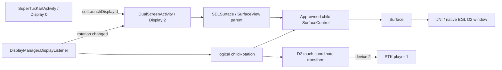

# 芯片平台 & 双屏开发实战手册

> 基于 **Go3DGlobe (RK356x)** 与 **GoDualScreen (V900)** 两个项目的真机实战经验。
> 覆盖：芯片特性、双屏异显、ADB 调试、签名部署、性能优化、踩坑记录。
> 适用于同平台新项目的快速启动参考。

---

## 目录

1. [芯片平台概览](#1-芯片平台概览)
2. [双屏异显架构](#2-双屏异显架构)
3. [开发环境与部署](#3-开发环境与部署)
4. [签名与权限](#4-签名与权限)
5. [ADB 调试命令集](#5-adb-调试命令集)
6. [性能与优化](#6-性能与优化)
7. [实战踩坑记录](#7-实战踩坑记录)
8. [附录：快速参考卡片](#8-附录快速参考卡片)

---

## 1. 芯片平台概览

### 1.1 RK356x (Go3DGlobe 项目)

| 特性 | 规格 |
|------|------|
| **设备型号** | RK356x (huanglong) |
| **SoC** | 4核 ARM Cortex-A55 |
| **GPU** | Mali-G52 (OpenGL ES 3.2) |
| **Android** | 12 (API 31) |
| **显示** | 双屏: Display 0 (1920×1280) + Display 2 (1920×1280) |
| **ADB** | `192.168.3.46:5555` (WiFi) |
| **签名** | AOSP 平台测试密钥 |
| **编译** | JDK 17, compileSdk 34, minSdk 31 |

### 1.2 V900 (GoDualScreen 项目)

| 特性 | 规格 |
|------|------|
| **设备型号** | HL2.0 (huanglong) |
| **SoC** | 8核 ARM Cortex-A73 (CPU part 0xd09) |
| **GPU** | Mali-G52 6核 (OpenGL ES 3.2 / OpenCL 3.0) |
| **Android** | 12 (API 31) |
| **显示** | 双屏: Display 0 (1920×1280) + Display 2 (1920×1280) |
| **ADB** | WiFi 连接 |
| **特殊能力** | OpenCL 可用于 AI 推理加速 |

### 1.3 平台信息采集命令

```bash
# 设备型号 & 制造商
adb shell getprop ro.product.model          # HL2.0 / rk356x
adb shell getprop ro.product.manufacturer    # HL2.0
adb shell getprop ro.hardware                # huanglong

# CPU 信息
adb shell cat /proc/cpuinfo | grep -E "CPU part|processor"
# RK356x: CPU part: 0xd05 → Cortex-A55
# V900:   CPU part: 0xd09 → Cortex-A73

# GPU 信息
adb shell dumpsys SurfaceFlinger | grep "GLES:"
# GLES: ARM, Mali-G52, OpenGL ES 3.2

# 显示拓扑
adb shell dumpsys display | grep -E "Display Device|mViewports"

# Android 版本
adb shell getprop ro.build.version.sdk       # 31
adb shell getprop ro.build.version.release   # 12
```

### 1.4 Display ID 映射

| Display ID | 常见用途 | 说明 |
|:----------:|---------|------|
| 0 | 主屏 | `DEFAULT_DISPLAY`，始终存在 |
| 1 | 保留/内屏 | 可能不存在 |
| 2 | 副屏 (HDMI/DSI) | **本项目使用** |
| 3+ | 额外扩展 | 多屏场景 |

> **重要**: Display ID 不保证连续。代码应枚举 `DisplayManager.displays` 而非硬编码索引。

---

## 2. 双屏异显架构

### 2.1 方案对比

| 方案 | 适用场景 | 本项目 |
|------|---------|:------:|
| **双 Activity** | 独立 UI、独立交互 | ✅ Go3DGlobe / GoDualScreen |
| **Presentation API** | 第二屏显示辅助信息 | ❌ 不适合独立交互 |

**双 Activity 优势**：
- 每个屏幕独立的生命周期
- 独立的触摸事件、按钮、UI 布局
- 不会干扰后台 App 音频

### 2.2 Globe 双屏架构 (Go3DGlobe)

```
┌─────────────────────────┐    ┌─────────────────────────┐
│   Display 0 (主屏)       │    │   Display 2 (副屏)       │
│                         │    │                         │
│  MainActivity           │    │  GlobeActivity          │
│  设置菜单 + 国家列表      │    │  NASA WorldWind 3D地球   │
│  DeepSeek AI 悬浮窗      │    │  + 航班/船舶/台风图层     │
│  displayId = 0          │    │  displayId = 2          │
└─────────────────────────┘    └─────────────────────────┘
```

### 2.3 副屏 Activity 启动（反射 API）

```kotlin
// 反射调用隐藏 API: ActivityOptions.setLaunchDisplayId(displayId)
fun launchOnDisplay(targetDisplayId: Int) {
    val intent = Intent(this, GlobeActivity::class.java)
    if (Build.VERSION.SDK_INT >= 26) {
        try {
            val options = android.app.ActivityOptions.makeBasic()
            val method = options.javaClass.getMethod(
                "setLaunchDisplayId",
                Int::class.javaPrimitiveType  // ⚠️ 注意: javaPrimitiveType 不是 javaObjectType
            )
            method.invoke(options, targetDisplayId)
            startActivity(intent, options.toBundle())
        } catch (_: Exception) {
            startActivity(intent)  // 反射失败 → 降级
        }
    } else {
        startActivity(intent)
    }
}
```

### 2.4 主屏防呆机制

```kotlin
// 在 MainActivity.onCreate 极早期检测
override fun onCreate(savedInstanceState: Bundle?) {
    super.onCreate(savedInstanceState)

    val launchedDisplayId = windowManager.defaultDisplay.displayId
    if (launchedDisplayId != Display.DEFAULT_DISPLAY) {
        // 被错误启动到副屏 → 强制迁回主屏
        val options = ActivityOptions.makeBasic()
        options.launchDisplayId = Display.DEFAULT_DISPLAY  // 公开 API
        startActivity(
            Intent(this, MainActivity::class.java)
                .addFlags(Intent.FLAG_ACTIVITY_NEW_TASK or
                          Intent.FLAG_ACTIVITY_CLEAR_TASK),
            options.toBundle()
        )
        finish()
        return
    }
    // ... 正常初始化 ...
}
```

### 2.5 AndroidManifest 双屏配置

```xml
<application android:resizeableActivity="true">

    <!-- 主屏 -->
    <activity
        android:name=".MainActivity"
        android:exported="true"
        android:screenOrientation="landscape"
        android:configChanges="orientation|screenSize|screenLayout|keyboardHidden|smallestScreenSize">
        <intent-filter>
            <action android:name="android.intent.action.MAIN" />
            <category android:name="android.intent.category.LAUNCHER" />
        </intent-filter>
    </activity>

    <!-- 副屏 GlobeActivity — 关键配置 -->
    <activity
        android:name=".GlobeActivity"
        android:exported="false"
        android:screenOrientation="landscape"
        android:launchMode="singleInstance"  <!-- ⚠️ 关键! 防多实例 -->
        android:configChanges="orientation|screenSize|screenLayout|keyboardHidden|smallestScreenSize" />

    <!-- 权限 -->
    <uses-permission android:name="android.permission.SYSTEM_ALERT_WINDOW" />
</application>
```

### 2.6 双屏 Activity 生命周期管理

```kotlin
// 退出应用 — 必须先关闭副屏
fun exitApp() {
    try { globeActivity?.finish() } catch (_: Exception) {}
    globeActivity = null
    handler.postDelayed({ finishAffinity() }, 150)
}

// Home 键 — 直接退出（双屏不适合后台）
override fun onUserLeaveHint() {
    super.onUserLeaveHint()
    finishAffinity()
}

// 从后台恢复 — 副屏丢失则重建
override fun onRestart() {
    super.onRestart()
    if (globeActivity == null) launchGlobeScreen()
}
```

### 2.6b 双屏任务隐藏最近列表（不显示在后台任务中）

**需求**：双屏 app 切换到后台后，不在 Android 最近任务列表中显示。

**双 Activity 方案**（Go3DGlobe 架构）：

副屏 Activity 的 Manifest 配置：
```xml
<activity
    android:name=".GlobeActivity"
    android:excludeFromRecents="true"
    android:autoRemoveFromRecents="true"
    ... />
```

启动副屏时使用 `FLAG_ACTIVITY_NEW_TASK`：
```kotlin
val intent = Intent(this, GlobeActivity::class.java)
    .addFlags(Intent.FLAG_ACTIVITY_NEW_TASK)
startActivity(intent, options.toBundle())
```

> **说明**：`excludeFromRecents="true"` 使整个任务不出现在最近列表。  
> 配合 `autoRemoveFromRecents="true"`，任务结束后自动移除。  
> 注意：不要同时使用 `finishAffinity()`，否则 C++ NDK 线程可能出现竞态。

**旧 Presentation API 方案**（STK SDL 历史架构，方向控制已由 2.7 节取代）：

STK 早期使用 `android.app.Presentation` 承载副屏。以下内容仅保留用于旧版本生命周期排查；当前版本使用 D2 专用 Activity，详见 2.7 节。
```xml
<activity
    android:name=".SuperTuxKartActivity"
    android:launchMode="singleTask"
    android:excludeFromRecents="true"
    android:autoRemoveFromRecents="true"
    ... />
```

Presentation 生命周期跟随主 Activity：
- `onStop()` → `mPresentation.dismiss()` → 副屏消失
- `onStart()` → `mPresentation.show()` → 副屏恢复
- `finish()` → `mPresentation.destroy()` → 完全退出

> **关键**：`excludeFromRecents` 只隐藏不杀任务，配合 `dismiss()/show()` 管理 Presentation，避免 C++ 原生线程竞态。

### 2.6c 终极措施：强制杀进程（HOME 键完全退出）

**适用场景**：
- C++ NDK 应用，原生线程（SDL 主循环）异步退出时存在竞态
- HOME 后第一次冷启动状态错乱（只有主屏、缺副屏），第二次才正常
- 需要保证每次 HOME → 重新点击图标都是**完全干净**的冷启动

**方案**：`Process.killProcess()` 硬杀进程。不走异步线程清理，直接终止进程。

```java
import android.os.Process;

@Override
protected void onUserLeaveHint() {
    super.onUserLeaveHint();
    // 1. 先关闭副屏 Presentation
    if (mPresentation != null) {
        mPresentation.dismiss();
        mPresentation = null;
    }
    // 2. 清理 Activity 任务栈
    finishAffinity();
    // 3. 硬杀进程 — 确保无任何线程残留
    Process.killProcess(Process.myPid());
}
```

**为什么不用 `nativeSendQuit()` 或 `System.exit()`**：

| 方法 | 问题 |
|------|------|
| `nativeSendQuit()` | 异步发送退出信号，SDL 线程退出需要时间，快速重启时旧线程未清理完 |
| `System.exit(0)` | 走 Runtime shutdown hook，NDK 库可能不响应，残留内存映射 |
| `finishAffinity()` 单独 | 只关 Activity，C++ 线程仍在运行 |
| `Process.killProcess()` ✅ | Linux 级别 SIGKILL，瞬间释放所有线程、内存、文件描述符 |

**AndroidManifest 配合**：
```xml
<activity
    android:excludeFromRecents="true"
    android:autoRemoveFromRecents="true"
    ... />
```
HOMe 后不显示在最近任务，避免用户从列表恢复半死进程。

> **⚠️ 注意**：这是终极措施，适用于 NDK 游戏等有独立原生线程的应用。  
> 纯 Java/Kotlin 应用不需要，用 `finishAffinity()` 即可。  
> **已被 STK 双屏卡丁车项目实战验证（RK356x / Mali-G52 / Android 12 / SDL2 Presentation 架构）。**

### 2.6d STK 特例：C++ NDK + SDLActivity 的 D2→D0 防呆重定向

**背景**：STK 项目继承自 `org.libsdl.app.SDLActivity`。早期版本使用 Presentation API，当前版本使用 D2 专用 Activity，但两种版本都要求主 `SuperTuxKartActivity` 在 D0 初始化 SDL。双屏启动器可能从 D2 误启动主 Activity，造成主屏灰色无渲染、副屏仍显示桌面。

**与 Go3DGlobe 防呆（2.4 节）的关键区别**：

| 差异点 | Go3DGlobe (双 Activity) | STK (SDL + Presentation) |
|--------|------------------------|--------------------------|
| 基类 | 自定义 MainActivity | `SDLActivity` (C++ NDK) |
| 副屏方案 | 独立 Activity | 早期为 `Presentation`，当前为 D2 专用 Activity |
| `setLaunchDisplayId` | 公开 API `options.launchDisplayId` | 反射（compile SDK 中 `@hide`） |
| 生命周期约束 | `super.onCreate()` 后检测 | **必须先 `super.onCreate()`** 否则崩溃 |

**致命踩坑：`SuperNotCalledException`**

在 `onCreate()` 中检测到 D2 → `finish()` + `startActivity()` → `return`，如果 `return` 之前没有调用 `super.onCreate()`，Android 会抛出：

```
android.util.SuperNotCalledException:
  Activity did not call through to super.onCreate()
```

这是因为 Android 在 `ActivityThread.performLaunchActivity()` 中检查 `super.onCreate()` 是否被调用，未调用则直接崩溃。崩溃对话框显示在主屏上即"主屏灰色"的假象——实际是 App 已崩溃，SDL 从未初始化。

**正确实现**（SuperTuxKartActivity.java）：

```java
@Override
protected void onCreate(Bundle savedInstanceState) {
    // ⚠️ 必须无条件先调用 super.onCreate()，满足 Android 生命周期约束
    super.onCreate(savedInstanceState);

    // 防呆：如果被副屏启动器误启动到非主屏，强制迁回主屏
    final int launchedDisplayId = getWindowManager()
        .getDefaultDisplay().getDisplayId();
    if (launchedDisplayId != Display.DEFAULT_DISPLAY) {
        Log.w("STK", "Launched on display " + launchedDisplayId
            + " — redirecting to D0");

        // 反射调用隐藏 API setLaunchDisplayId 指定目标屏
        try {
            final android.app.ActivityOptions opts =
                android.app.ActivityOptions.makeBasic();
            final java.lang.reflect.Method m = opts.getClass()
                .getMethod("setLaunchDisplayId", int.class);
            m.invoke(opts, Display.DEFAULT_DISPLAY);
            final Intent intent = new Intent(this, SuperTuxKartActivity.class)
                .addFlags(Intent.FLAG_ACTIVITY_NEW_TASK
                        | Intent.FLAG_ACTIVITY_CLEAR_TASK);
            startActivity(intent, opts.toBundle());
        } catch (Exception e) {
            // 反射失败降级：直接 startActivity
            // （可能仍在 D2，会再次进入防呆分支，形成安全循环直到成功）
            Log.w("STK", "setLaunchDisplayId failed: " + e.getMessage());
            final Intent intent = new Intent(this, SuperTuxKartActivity.class)
                .addFlags(Intent.FLAG_ACTIVITY_NEW_TASK
                        | Intent.FLAG_ACTIVITY_CLEAR_TASK);
            startActivity(intent);
        }
        // 先 startActivity 再 finish，避免旧窗口先销毁导致进程被提前终止
        finish();
        return;
    }

    // D0 正常路径：继续初始化
    m_initial_orientation = getRequestedOrientation();
}
```

**执行时序**：

```
D2启动器 → STK(在D2)
  → super.onCreate()          // ① 满足生命周期（避免 SuperNotCalledException）
  → 检测到 D2
  → 反射 setLaunchDisplayId(0) // ② 指定新 Activity 在 D0 启动
  → startActivity(NEW_TASK|CLEAR_TASK)  // ③ 在 D0 启动新实例
  → finish()                   // ④ 销毁 D2 上的旧实例
  → 新实例在 D0 启动
    → super.onCreate()
    → 检测到 D0 → 正常初始化 SDL → 双屏正常
```

**为什么 `startActivity` 必须在 `finish()` 之前**：

`finish()` 触发 Activity 销毁流程，如果先 `finish()` 再 `startActivity()`，可能因生命周期回调（如 `onUserLeaveHint()`）触发 `Process.killProcess()` 提前杀进程，导致 `startActivity()` 未执行。

**`FLAG_ACTIVITY_CLEAR_TASK` 的作用**：

清除 D2 任务栈，确保新 Activity 不受旧任务 Display 偏好的污染。配合 `FLAG_ACTIVITY_NEW_TASK` 在新任务栈中启动。

**降级路径**：

如果反射 `setLaunchDisplayId` 失败（某些定制 ROM 移除了该 API），catch 分支直接 `startActivity` 不指定 Display。新 Activity 可能仍在 D2 启动，会再次进入防呆分支，形成安全循环：每次尝试都会 `startActivity` + `finish()`，直到某次运气好落到 D0。实测 RK356x / Android 12 上反射稳定成功，降级路径极少触发。

> **适用条件**：C++ NDK 应用 + SDLActivity 双屏架构 + 双屏启动器存在。
> 纯 Java/Kotlin 双 Activity 架构使用 2.4 节的公开 API 方案即可。

### 2.7 RK356x 副屏物理方向固定：D2 Activity + 动态子 SurfaceControl 反补偿（2026-07-24 真机验证）

> **最终结论**：STK 的 D2 渲染最初由 `Presentation` 承载，但 `Presentation` 不能成为非默认显示器的方向策略所有者。最终方案由 D2 专用 Activity 接管窗口生命周期和 Display 变化监听，再由应用自建的子 `SurfaceControl` 承载 EGL Surface。厂商仍可根据 G-sensor 让 D2 在 rotation 0/2 间变化，应用不尝试屏蔽该变化，而是读取每次有效 rotation，给游戏子层施加对应的逆变换，并用同一逻辑同步触摸坐标。这样系统 rotation 可以变化，物理副屏中的游戏方向保持不变。

#### 2.7.1 这台设备的方向控制分为四层

| 层级 | 真机观察 | 能否保证 STK 的 D2 固定方向 |
|------|----------|-----------------------------|
| 厂商属性 | `persist.vendor.prop.screenorientation.ext=seascape` | 只能描述外屏默认策略，不能证明当前窗口画面已锁定 |
| WindowManager DisplayRotation | D2 的 base rotation 为 0，override/effective rotation 可为 2 | 决定 Display 2 的最终逻辑旋转 |
| 顶层 Activity 方向请求 | `reverseLandscape` 对应 `requestedOrientation=8` | 让 STK 成为 D2 的方向所有者，但厂商仍可能根据 G-sensor 改变有效 rotation |
| 应用自有子 `SurfaceControl` | EGL 渲染到子 Surface，按有效 rotation 动态调用 `setGeometry` | **可以**；直接反补偿游戏图层的最终合成像素 |

设备上的相关厂商属性：

```bash
adb -s 192.168.3.46:5555 shell getprop | grep -Ei \
    'screenorientation|rotation|display'

# 实测关键输出
[persist.prop.screenorientation.ext]: [seascape]
[persist.vendor.prop.screenorientation]: [landscape]
[persist.vendor.prop.screenorientation.ext]: [seascape]
[vendor.display.count]: [2]
```

方向数值含义：

| 数值 | Android 常量 | 含义 |
|:----:|--------------|------|
| 0 | `Surface.ROTATION_0` | 0° |
| 1 | `Surface.ROTATION_90` | 90° |
| 2 | `Surface.ROTATION_180` | 180° |
| 3 | `Surface.ROTATION_270` | 270° |
| 8 | `SCREEN_ORIENTATION_REVERSE_LANDSCAPE` | Activity 请求反向横屏；本机最终得到 rotation 2 |

#### 2.7.2 为什么旧的 Presentation 方案无法锁方向

旧架构中 D2 只有 `Presentation` 窗口，没有属于 STK 的 D2 Activity。WindowManager 日志显示 D2 的 focused app 可能仍是：

```text
com.android.launcher3/.secondarydisplay.SecondaryDisplayLauncher
```

因此，在 `Presentation.getWindow()` 上设置 `screenOrientation`，并不能让 STK 成为 Display 2 的 orientation source。以下方法均已真机验证为无效，不应再次使用：

| 尝试 | 运行结果 | 原因判断 |
|------|----------|----------|
| 父 `View.setRotation(180)` | 触摸坐标可能变化，但 `SurfaceView` 游戏画面未旋转 | SurfaceView 由独立 Surface 合成，不等同于普通 View 内容 |
| 手工反转触摸坐标 | 只改变输入，画面仍未旋转 | 输入修正不能代替显示旋转 |
| `ANativeWindow_setBuffersTransform(ROTATE_180)` | API 返回/日志正常，但肉眼与截图均未旋转 | buffer transform 未成为该厂商合成链路的最终显示策略 |
| Presentation Window 请求 `reverseLandscape` | 未改变 D2 有效方向 | Presentation 不是非默认显示器的 Activity orientation owner |
| 只使用 D2 Activity + `reverseLandscape` | WMS 为 `mLastOrientation=8 / mRotation=2`，但 `.54` 截图仍是正向 | 厂商外屏策略已做补偿；逻辑 rotation 不等于应用像素发生额外旋转 |

**判断原则**：API 调用成功或 WMS 显示 `mRotation=2` 都不等于画面生效。`screencap -d 2` 只能证明逻辑显示合成结果，也不能单独代表外屏面板最终输出。证据强度从低到高应为：Java 调用日志、WMS rotation、SurfaceFlinger 子层矩阵、实车物理画面。最终验收必须同时看到正确的 SurfaceFlinger 矩阵和实车画面保持固定。

#### 2.7.3 正确架构：D0 主 Activity + D2 专用 Activity



核心约束是只保留一套 STK 进程和游戏状态。两个 Activity 分别持有 D0、D2 的 Android 窗口，但 D2 Activity 不启动第二套 native main loop；它只是向已有 native 双屏接口提供新的 EGL window。

D2 Activity 的 Manifest 核心配置：

```xml
<activity
        android:name="org.libsdl.app.DualScreenActivity"
        android:theme="@android:style/Theme.Black.NoTitleBar.Fullscreen"
        android:launchMode="singleInstance"
        android:taskAffinity="org.supertuxkart.stk.secondary"
        android:excludeFromRecents="true"
        android:screenOrientation="reverseLandscape"
        android:configChanges="fontScale|keyboard|keyboardHidden|locale|mcc|mnc|navigation|orientation|screenLayout|screenSize|uiMode|layoutDirection|smallestScreenSize"
        android:resizeableActivity="true"
        android:exported="false" />
```

主 Activity 在 SDL/GL 就绪后枚举副屏，并明确把 D2 Activity 启动到目标 Display：

```java
Intent intent = new Intent(this, DualScreenActivity.class)
        .addFlags(Intent.FLAG_ACTIVITY_NEW_TASK);
ActivityOptions options = ActivityOptions.makeBasic();
options.setLaunchDisplayId(secondDisplay.getDisplayId());
startActivity(intent, options.toBundle());
```

`DualScreenActivity` 只负责以下内容：

1. 在 Display 2 持有顶层 Activity 和固定方向请求。
2. 创建第二个 `SDLSurface`，继续调用 `onNativeSecondSurfaceCreated/Changed`。
3. 显示并在 native D2 ready 后隐藏 loading view。
4. Activity 销毁时释放 D2 Surface；主 Activity 退出时同步结束副屏 Activity。

这样不会启动第二个游戏进程，也不会创建第二套 STK 游戏状态。D0、D2 Activity 同进程运行，D2 只是替代 Presentation 成为第二个 Surface 和方向策略的宿主。

为了真正旋转游戏像素，不能直接修改 `SurfaceView.getSurfaceControl()`。Android 官方文档说明该 SurfaceControl 实际上只适合作为应用子层的 parent，SurfaceView 随时可能覆盖它的位置和变换。正确做法是在 `surfaceChanged` 后创建应用自有子层：

```java
SurfaceControl child = new SurfaceControl.Builder()
    .setName("SDL Display 2 rotated surface")
    .setParent(getSurfaceControl())
    .setBufferSize(width, height)
    .setFormat(PixelFormat.RGBX_8888)
    .setOpaque(true)
    .build();

Surface renderSurface = new Surface(child);

int displayRotation = display.getRotation();
int childRotation;
switch (displayRotation) {
    case Surface.ROTATION_90:
        childRotation = Surface.ROTATION_270;
        break;
    case Surface.ROTATION_270:
        childRotation = Surface.ROTATION_90;
        break;
    default:
        childRotation = displayRotation;
        break;
}

int surfaceTransform;
switch (childRotation) {
    case Surface.ROTATION_90:
        surfaceTransform = SurfaceControl.BUFFER_TRANSFORM_ROTATE_90;
        break;
    case Surface.ROTATION_180:
        surfaceTransform = SurfaceControl.BUFFER_TRANSFORM_ROTATE_180;
        break;
    case Surface.ROTATION_270:
        surfaceTransform = SurfaceControl.BUFFER_TRANSFORM_ROTATE_270;
        break;
    default:
        surfaceTransform = SurfaceControl.BUFFER_TRANSFORM_IDENTITY;
        break;
}

SurfaceControl.Transaction transaction = new SurfaceControl.Transaction();
transaction.setGeometry(child,
    new Rect(0, 0, width, height),
    new Rect(0, 0, width, height),
    surfaceTransform);
transaction.setVisibility(child, true);
transaction.apply();
transaction.close();
```

`Surface.ROTATION_*` 和 `SurfaceControl.BUFFER_TRANSFORM_*` 不是同一组数值，不能把 `childRotation` 直接传给 `setGeometry`。特别是 `Surface.ROTATION_180 == 2`，但 SurfaceControl 中 `2` 表示 `BUFFER_TRANSFORM_MIRROR_VERTICAL`；真正的 `BUFFER_TRANSFORM_ROTATE_180 == 3`。错误传入 `2` 时，SurfaceFlinger 会显示 `geomLayerTransform (FLIP_V)`，正确传入 `3` 后才会显示 `geomLayerTransform (ROT_180)`。

JNI/EGL 接收 `renderSurface`，不再直接接收 `SurfaceHolder.getSurface()`。Surface 销毁时必须依次通知 native、`Surface.release()`、`SurfaceControl.release()`，避免旧 EGL window 和合成图层残留。

这里不能把子层永远写死为 180°。厂商 D2 会读取主屏缓存的 `sensorRotation`，再执行 `compensated +180° for head-to-head panel`；当系统把 D2 从 rotation 2 切到 rotation 0 时，固定 180°的子层会跟着物理显示再翻一次。正确关系是让子层始终取当前 D2 rotation 的逆旋转：

| D2 当前 rotation | 子层 rotation | 合成后的物理方向 |
|:----------------:|:-------------:|:----------------:|
| 0 | 0 | 固定基准方向 |
| 1 (90°) | 3 (270°) | 固定基准方向 |
| 2 (180°) | 2 (180°) | 固定基准方向 |
| 3 (270°) | 1 (90°) | 固定基准方向 |

`DualScreenActivity` 必须注册 `DisplayManager.DisplayListener`，在 `onDisplayChanged(displayId)` 中立即重新读取 `Display.getRotation()` 并更新子层；`onConfigurationChanged()` 和 `onResume()` 也要执行同一刷新。这样系统方向变化不会重建游戏进程或 EGL，实测切换前后 PID 保持不变。

#### 2.7.4 G-sensor 与系统旋转消息为什么不再影响 D2

测试前先确认没有 ADB 人工锁定掩盖应用行为：

```bash
adb -s 192.168.3.46:5555 shell wm user-rotation -d 2
adb -s 192.168.3.46:5555 shell wm fixed-to-user-rotation -d 2
adb -s 192.168.3.46:5555 shell wm get-ignore-orientation-request -d 2

# 验证时的基线
free
default
ignoreOrientationRequest false for displayId=2
```

在这个基线下，G-sensor 仍可向系统发送旋转变化。D2 顶层 Activity 首先请求 `reverseLandscape`；如果厂商策略仍强制改变 D2 rotation，DisplayListener 会把子 `SurfaceControl` 切换为新的逆旋转，从而抵消系统变化：

```text
deepestLastOrientationSource=...DualScreenActivity
mLastOrientation=8
mRotation=2
mUserRotationMode=USER_ROTATION_FREE
```

远程验证时可用以下命令强制 D2 在 0°和 180°之间切换。`fixed-to-user-rotation enabled` 只用于测试，结束后必须恢复：

```bash
adb -s 192.168.3.54:5555 shell wm set-ignore-orientation-request -d 2 true
adb -s 192.168.3.54:5555 shell wm fixed-to-user-rotation -d 2 enabled
adb -s 192.168.3.54:5555 shell wm user-rotation -d 2 lock 0
adb -s 192.168.3.54:5555 shell wm user-rotation -d 2 lock 2
```

实测同一进程中自动产生：

```text
D2 rotation compensation: display=0 childRotation=0 surfaceTransform=0
Display changed, refreshing D2 rotation compensation
D2 rotation compensation: display=2 childRotation=2 surfaceTransform=3
```

测试结束必须完整恢复，而不是只恢复 `user-rotation`：

```bash
adb -s 192.168.3.54:5555 shell wm user-rotation -d 2 free
adb -s 192.168.3.54:5555 shell wm fixed-to-user-rotation -d 2 default
adb -s 192.168.3.54:5555 shell wm set-ignore-orientation-request -d 2 false
```

触摸变换必须使用当前的 `childRotation`，不能永远写死 `x=1-x, y=1-y`。rotation 0 时不变换；rotation 2 时反转 X/Y；rotation 1/3 时交换并反转对应轴。

#### 2.7.5 必须执行的验证闭环

```bash
# 1. 确认 D0/D2 分别由两个 Activity 持有
adb -s 192.168.3.46:5555 shell dumpsys activity activities | \
    grep -E 'Display #[02]|mResumedActivity.*(DualScreenActivity|SuperTuxKartActivity)'

# 2. 确认 D2 的方向来源和有效旋转
adb -s 192.168.3.46:5555 shell dumpsys window displays | \
    sed -n '/Display: mDisplayId=2/,/Display: mDisplayId=/p' | \
    grep -E 'deepestLastOrientationSource|mLastOrientation=|mRotation=|mUserRotationMode='

# 3. 截取 D2 逻辑合成结果；不能单独据此判断物理面板方向
adb -s 192.168.3.46:5555 shell screencap -d 2 -p /sdcard/d2.png
adb -s 192.168.3.46:5555 pull /sdcard/d2.png /tmp/d2.png

# 4. 确认旋转子层确实存在
adb -s 192.168.3.46:5555 shell dumpsys SurfaceFlinger --list | \
    grep 'SDL Display 2 rotated surface'

# 5. 验证 D2 触摸仍进入 P1，并随当前 childRotation 动态映射
adb -s 192.168.3.46:5555 logcat -c
adb -s 192.168.3.46:5555 shell input -d 2 swipe 300 640 300 640 300
adb -s 192.168.3.46:5555 logcat -d | \
    grep -E 'onTouch: display=2|Touch dev=2|player_id=1|X=1620'
```

2026-07-24 在 `192.168.3.46:5555` 的 release 包实测结果：

```text
Display #2: DualScreenActivity resumed
Display #0: SuperTuxKartActivity resumed
DualScreenActivity onCreate: display=2 rotation=2 requestedOrientation=8
D2 surfaceChanged: 1920x1280
mLastOrientation=8
mRotation=2
mUserRotationMode=USER_ROTATION_FREE
SDL Display 2 rotated surface
physical X=300 -> logical X=1620
Touch dev=2 -> player_id=1
```

随后在 `192.168.3.54:5555` 发现仅有上述 WMS 状态时截图仍为正向，推翻了“Activity orientation 足以旋转像素”的判断。加入子 `SurfaceControl` 后，release 逻辑截图中的文字、按钮和赛车能够整体倒置，这一步只证明应用已经取得游戏像素层的变换控制权，尚不能证明物理方向已经固定。由于图像坐标发生变化，D2 触摸也必须同步映射；实测物理 `X=300` 得到逻辑 `X=1620`，并继续路由到 `device=2 / player_id=1`。

进一步的系统翻转测试发现，厂商会根据主屏传感器缓存让 D2 在 rotation 0/2 间变化，因此最终实现改为动态逆旋转。第一次实现错误地把 `Surface.ROTATION_180` 的数值 `2` 直接交给 `setGeometry`，SurfaceFlinger 实际执行的是 `FLIP_V`，所以实车仍会跟随系统旋转。改用 `BUFFER_TRANSFORM_ROTATE_180=3` 后，在 `.54` 上连续物理翻转并经历多次传感器 0/2 抖动，PID `23455` 始终不变，日志稳定对应 `display=0 -> surfaceTransform=0`、`display=2 -> surfaceTransform=3`，实车物理画面保持不变。触摸在 rotation 0 时 `X=300 -> 300`，rotation 2 时 `X=300 -> 1620`。

`screencap -d 2` 捕获的是逻辑显示合成层，不包含外屏面板最终输出变换；rotation 0/2 的截图方向可能不同，即使物理面板画面已经固定。最终判据必须同时包含 SurfaceFlinger 矩阵、运行日志和实车物理观察，不能只看截图。

#### 2.7.6 最终改动清单

| 文件 | 改动 | 设计目的 |
|------|------|----------|
| `android/AndroidManifest.xml` | 注册 `DualScreenActivity`；使用 `singleInstance`、独立 `taskAffinity`、`reverseLandscape` 和完整 `configChanges` | 让 D2 有自己的 Activity/Window 方向所有者，同时避免 rotation 变化销毁 Activity |
| `SDLActivity.java` | API 26+ 使用 `ActivityOptions.setLaunchDisplayId()` 把 D2 Activity 启动到外屏；旧 API 保留 Presentation 降级；主 Activity 销毁时结束 D2 Activity | 从 Presentation 迁移到同进程双 Activity，并完整管理退出生命周期 |
| `DualScreenActivity.java` | 创建 D2 `SDLSurface`；注册 `DisplayListener`；在 display change、configuration change、resume 时刷新变换；native ready 后隐藏 loading | 把 D2 的窗口、Surface 和 rotation 更新集中到一个宿主中 |
| `SDLSurface.java` | 创建应用自有子 `SurfaceControl` 和 `Surface`；把子 Surface 交给 native EGL；动态计算逆旋转；映射 SurfaceControl 变换常量；同步触摸坐标；按顺序释放 Surface/SurfaceControl | 真正控制游戏像素，而不是只旋转普通 View；保证显示和输入使用同一坐标系 |
| `docs/chip.md` | 记录厂商方向模型、失败方案、常量陷阱、验证与恢复命令 | 防止后续只看 WMS 或截图再次误判 |

`src/main_loop.cpp` 中 D2 FPS 上限 30 到 45 的改动属于独立性能调整，不是本方向修复的依赖。回滚或修改 FPS 不应影响固定方向逻辑。

#### 2.7.7 调试时间线与被推翻的假设

| 阶段 | 当时假设 | 实测证据 | 结论 |
|------|----------|----------|------|
| 1. Presentation 请求方向 | 给 Presentation Window 设置 `reverseLandscape` 即可 | D2 的 orientation source 仍可能是 SecondaryDisplayLauncher；有效方向不受 STK 控制 | Presentation 不是 D2 Activity 方向所有者，架构层级不够 |
| 2. 旋转普通 View | `View.setRotation(180)` 会带着游戏画面旋转 | 普通控件/触摸可能变化，SurfaceView 的独立合成像素不变 | SurfaceView 不能按普通 View 内容处理 |
| 3. native buffer transform | `ANativeWindow_setBuffersTransform` 返回成功就代表最终像素旋转 | API/日志成功，物理画面和截图无变化 | 调用成功只是控制面证据，厂商合成链路没有采用该变换 |
| 4. D2 专用 Activity | `requestedOrientation=8` 且 WMS `mRotation=2` 就已经完成 | WMS 状态正确，但逻辑截图和实车像素关系仍不符合目标 | Activity 必须保留，但它只解决 ownership，不能单独解决像素合成 |
| 5. 修改 SurfaceView 自有 SurfaceControl | 直接修改 `getSurfaceControl()` 可以长期持有变换 | SurfaceView 会管理并覆盖其自身层状态 | 该层只作为稳定 parent，另建应用自有 child |
| 6. 固定 child 180° | 设备安装方向固定，子层永远 180°即可 | 强制测试能看到像素变化，但真实 G-sensor 后 D2 在 rotation 0/2 间切换，画面仍会跟随 | 补偿必须读取当前 D2 rotation，不能写死 |
| 7. 动态 `childRotation` | 把 `Surface.ROTATION_*` 原值传入 `setGeometry` 即可 | 日志显示 `child=2` 看似正确，但 SurfaceFlinger 显示 `FLIP_V`，实车仍会旋转 | `Surface` rotation 和 SurfaceFlinger transform 是两套数值域 |
| 8. 正确 transform 映射 | rotation 2 应映射为 SurfaceControl transform 3 | SurfaceFlinger 从 `FLIP_V` 变为 `ROT_180`；实车连续翻转保持不变 | 根因闭环，最终方案成立 |

最后一个坑最隐蔽，因为日志中的 `display=2 child=2` 在语义上完全合理，但 `setGeometry` 最终进入 native `ui::Transform::RotationFlags`。Android 12 AOSP 的 `Transform.h` 明确定义 `FLIP_V=2`、`ROT_90=4`、`ROT_180=FLIP_H|FLIP_V=3`、`ROT_270=7`。本机 SurfaceFlinger dump 直接验证了这组解释：

```text
# 错误实现：把 Surface.ROTATION_180 的 2 直接传给 setGeometry
geomLayerTransform (FLIP_V)

# 正确实现：传 BUFFER_TRANSFORM_ROTATE_180 的 3
geomLayerTransform (ROT_180) (ROTATE TRANSLATE)
-1.0000  0.0000  1920.0000
 0.0000 -1.0000  1280.0000
 0.0000  0.0000     1.0000
```

官方依据：

- [AOSP SurfaceControl.java](https://android.googlesource.com/platform/frameworks/base/+/refs/tags/android-12.0.0_r1/core/java/android/view/SurfaceControl.java#77) 说明 SurfaceControl 是带 buffer source 和显示元数据的合成节点，子节点继承父节点几何属性。
- [AOSP SurfaceControl.Transaction.setGeometry](https://android.googlesource.com/platform/frameworks/base/+/refs/tags/android-12.0.0_r1/core/java/android/view/SurfaceControl.java#2882) 说明 source buffer 会在映射到 parent 坐标前按 orientation 旋转。
- [AOSP ui::Transform::RotationFlags](https://android.googlesource.com/platform/frameworks/native/+/refs/tags/android-12.0.0_r1/libs/ui/include/ui/Transform.h#45) 给出 SurfaceFlinger 使用的 0/1/2/4 位标志及组合值。

#### 2.7.8 调试中遇到的坑

1. **Display ID 有两套编号**：Android framework 中外屏是 logical display 2，但 SurfaceFlinger dump 中可能显示为 HWC/physical display 1。排查时必须同时看 layer stack 和 Activity 所在 display，不能只按数字搜索。
2. **WMS rotation 不是像素证据**：`mLastOrientation=8`、`mRotation=2` 只能证明 WindowManager 接受了方向状态，不能证明 EGL 游戏层最终如何合成。
3. **截图不是物理面板证据**：`screencap -d 2` 可能按逻辑显示坐标捕获，不包含外屏最后一级输出变换。rotation 0/2 截图方向不同，不代表物理屏也改变。
4. **单独执行 `wm user-rotation` 可能无效**：`reverseLandscape` Activity 仍可控制方向。可重复强制测试需要临时组合 `fixed-to-user-rotation enabled`、`set-ignore-orientation-request true` 和 `user-rotation lock N`。
5. **测试策略必须成组恢复**：只执行 `user-rotation free` 不够，必须恢复 `free/default/false` 三项，否则下一轮真实 G-sensor 测试会被 ADB 状态污染。
6. **传感器会抖动**：一次物理翻转可产生多次 0/2 往返。实现必须幂等地处理每次 `onDisplayChanged`，不能假设每次动作只有一个事件。
7. **不要在旋转动画中读取最终矩阵**：事务切换中 SurfaceFlinger 可能短暂显示非正交矩阵或 `ROT_INVALID`。必须等画面停稳后再次 dump，最终应为 `IDENTITY` 或 `ROT_180`。
8. **两个 rotation 枚举不能混用**：逻辑触摸旋转保留 `Surface.ROTATION_*=0/1/2/3`；传给合成层时必须映射为 `BUFFER_TRANSFORM_*=0/4/3/7`。
9. **显示和触摸必须共享同一状态**：只修画面会导致点击落在对侧。rotation 2 下物理 `X=300` 应映射到逻辑 `X=1620`；rotation 0 下保持 `X=300`。
10. **Surface 生命周期顺序重要**：D2 `surfaceChanged` 中应先创建 child 和 render Surface，再通知 native；销毁时先通知 native window 不再使用，然后 release `Surface` 和 `SurfaceControl`，防止 EGL 引用旧 window。
11. **PID 是低成本重建判据**：rotation 切换前后 PID 不变，且没有新的 `onCreate`/EGL init，才能证明只是更新合成事务，而不是靠重启掩盖问题。
12. **`tap` 不适合双屏帧交替测试**：瞬时事件可能落在错误帧；验证触摸路由时使用 `input -d 2 swipe` 维持多个事件帧更可靠。

#### 2.7.9 最终验证与恢复 SOP

在 `/Users/newlink/kemi/stk-code/android` 构建并安装：

```bash
./gradlew assembleRelease
adb -s 192.168.3.54:5555 install -r \
    build/outputs/apk/release/android-release.apk
adb -s 192.168.3.54:5555 shell am force-stop org.supertuxkart.stk
adb -s 192.168.3.54:5555 logcat -c
adb -s 192.168.3.54:5555 shell am start \
    -n org.supertuxkart.stk/.SuperTuxKartActivity
```

确认双 Activity、进程和初始变换：

```bash
adb -s 192.168.3.54:5555 shell pidof org.supertuxkart.stk
adb -s 192.168.3.54:5555 shell dumpsys activity activities | \
    grep -E 'DualScreenActivity|SuperTuxKartActivity|mResumedActivity'
adb -s 192.168.3.54:5555 logcat -d | \
    grep -E 'D2 rotation compensation|FATAL EXCEPTION'
```

执行受控 0/2 切换：

```bash
adb -s 192.168.3.54:5555 shell wm fixed-to-user-rotation -d 2 enabled
adb -s 192.168.3.54:5555 shell wm set-ignore-orientation-request -d 2 true
adb -s 192.168.3.54:5555 shell wm user-rotation -d 2 lock 0
adb -s 192.168.3.54:5555 shell wm user-rotation -d 2 lock 2
```

停稳后验证 SurfaceFlinger 子层，rotation 0 应为 `IDENTITY`，rotation 2 应为 `ROT_180`：

```bash
adb -s 192.168.3.54:5555 shell dumpsys SurfaceFlinger | \
    awk '/\* Layer .*bbq-wrapper#1/{show=1; count=0} \
         show{print; count++} count==18{show=0}'
```

恢复设备并核对三项输出：

```bash
adb -s 192.168.3.54:5555 shell wm user-rotation -d 2 free
adb -s 192.168.3.54:5555 shell wm fixed-to-user-rotation -d 2 default
adb -s 192.168.3.54:5555 shell wm set-ignore-orientation-request -d 2 false

adb -s 192.168.3.54:5555 shell wm user-rotation -d 2
adb -s 192.168.3.54:5555 shell wm fixed-to-user-rotation -d 2
adb -s 192.168.3.54:5555 shell wm get-ignore-orientation-request -d 2

# 必须为
free
default
ignoreOrientationRequest false for displayId=2
```

2026-07-24 最终 release 实测：设备 `.54` 连续物理翻转两次，传感器期间多次在 0/2 间抖动；应用日志每次都对应 `surfaceTransform=0/3`，PID `23455` 未变化，无 `FATAL EXCEPTION`，用户在实车上确认副屏物理画面始终保持不变。最终 APK SHA-256：

```text
0dfe3ce7cba638a528732f318ef5c67b35f99d6f9a7acd248eaf903fac432f24
```

当前实现的边界：loading overlay 是普通 View，启动阶段仍固定 `setRotation(180)`，native D2 ready 后即隐藏。已验收的方向保证覆盖 EGL 游戏画面；如果后续要求在 native ready 前翻转时 loading 也绝对固定，应让 loading 使用与 `mSecondSurfaceRotation` 相同的动态 View rotation，而不是继续写死 180°。

#### 2.7.10 可迁移到其他项目的特殊翻转方法

这套方法不依赖 STK 业务逻辑，适合以下情况：

- Android 外屏会跟随主屏 G-sensor 或厂商 DisplayRotation 改变方向。
- 副屏内容由 `SurfaceView`、OpenGL/EGL、Vulkan、MediaCodec 等独立 Surface 承载。
- `View.setRotation()`、Activity orientation 或 `ANativeWindow_setBuffersTransform()` 不能稳定改变物理输出。
- 应用可以在 Display 2 启动独立 Activity，并且运行环境支持 `SurfaceControl.Builder`（API 29+）。

通用设计不是“禁止系统旋转”，而是“允许系统 rotation 变化，再在应用像素子层做实时逆变换”：

$$
R_{child}=(-R_{display})\bmod 4
$$

其中 rotation 使用四分之一圈为单位。逻辑 rotation 与 SurfaceControl transform 必须经过显式映射：

| Display rotation | 逆向 child rotation | SurfaceControl transform | 数值 |
|:----------------:|:-------------------:|--------------------------|:----:|
| 0 | 0 | `BUFFER_TRANSFORM_IDENTITY` | 0 |
| 1 (90°) | 3 (270°) | `BUFFER_TRANSFORM_ROTATE_270` | 7 |
| 2 (180°) | 2 (180°) | `BUFFER_TRANSFORM_ROTATE_180` | 3 |
| 3 (270°) | 1 (90°) | `BUFFER_TRANSFORM_ROTATE_90` | 4 |

可复用的映射函数：

```java
private static int inverseDisplayRotation(int displayRotation) {
    switch (displayRotation) {
        case Surface.ROTATION_90:
            return Surface.ROTATION_270;
        case Surface.ROTATION_270:
            return Surface.ROTATION_90;
        default:
            return displayRotation;
    }
}

private static int toSurfaceTransform(int childRotation) {
    switch (childRotation) {
        case Surface.ROTATION_90:
            return SurfaceControl.BUFFER_TRANSFORM_ROTATE_90;
        case Surface.ROTATION_180:
            return SurfaceControl.BUFFER_TRANSFORM_ROTATE_180;
        case Surface.ROTATION_270:
            return SurfaceControl.BUFFER_TRANSFORM_ROTATE_270;
        default:
            return SurfaceControl.BUFFER_TRANSFORM_IDENTITY;
    }
}
```

应用步骤必须按以下顺序执行：

1. 使用 `ActivityOptions.setLaunchDisplayId(displayId)` 把专用 Activity 启动到副屏，让应用成为该 Display 的窗口生命周期所有者。
2. 保留 `SurfaceView.getSurfaceControl()` 作为 parent，不直接长期修改它的矩阵。
3. 创建 app-owned child `SurfaceControl`，再通过 `new Surface(child)` 得到真正交给 EGL/解码器的渲染目标。
4. 在 `surfaceChanged` 中设置 buffer size、source/destination rect 和初始 transform，然后再把 child Surface 通知给 native renderer。
5. 注册 `DisplayManager.DisplayListener`；`onDisplayChanged`、`onConfigurationChanged`、`onResume` 都调用同一个幂等刷新函数。
6. 触摸输入使用同一个 `childRotation` 做坐标变换，不能单独维护另一份方向状态。
7. Surface 销毁时先让 renderer 停止使用 window，再释放 `Surface` 和 `SurfaceControl`。

归一化触摸坐标 $(x,y)$ 的通用映射：

| child rotation | 变换后坐标 |
|:--------------:|------------|
| 0 | $(x,y)$ |
| 1 (90°) | $(y,1-x)$ |
| 2 (180°) | $(1-x,1-y)$ |
| 3 (270°) | $(1-y,x)$ |

最低验收条件：

- rotation 0 时日志为 `childRotation=0 surfaceTransform=0`，SurfaceFlinger 为 `IDENTITY`。
- rotation 2 时日志为 `childRotation=2 surfaceTransform=3`，SurfaceFlinger 为 `ROT_180`，不能是 `FLIP_V`。
- 连续物理翻转和传感器抖动期间 PID 不变、EGL 不重建、无 `FATAL EXCEPTION`。
- 物理副屏方向保持不变，D0 不受影响，D2 触摸仍命中原位置。
- 测试结束后 WMS 状态恢复为 `free/default/false`。

如果项目只显示普通 Android View，不含独立 Surface，应优先使用 Activity/布局层的常规方向方案；不要为了普通 UI 引入额外 SurfaceControl。只有 View 层方案无法控制实际像素时，才使用本节方法。

| 方向 | 方式 | 用途 |
|------|------|------|
| 主屏→副屏 | `GlobeState` 单例 | 图层开关、选中国家 |
| 副屏→主屏 | 直接方法调用 | 触摸事件回调 |
| 跨进程 | Broadcast | (未使用) |

```kotlin
object GlobeState {
    @Volatile var ctrlFlights = true
    @Volatile var ctrlShips = false
    @Volatile var voiceEnabled = true
    var onCountrySelected: ((String) -> Unit)? = null
}
```

---

## 3. 开发环境与部署

### 3.1 环境配置

| 项目 | 配置 |
|------|------|
| **JDK** | 17 (compileSdk 34) |
| **Kotlin** | 1.9.x |
| **Gradle** | 8.5 |
| **IDE** | Android Studio + VS Code |
| **ADB** | WiFi 连接 (无 USB) |

### 3.2 Gradle 关键配置

```kotlin
// build.gradle.kts
android {
    compileSdk = 34
    defaultConfig {
        minSdk = 31
        targetSdk = 34
    }
    compileOptions {
        sourceCompatibility = JavaVersion.VERSION_17
        targetCompatibility = JavaVersion.VERSION_17
    }
}

dependencies {
    // NASA WorldWind 3D 地球
    implementation("com.github.WorldWindEarth:WorldWindAndroid:9fa97e11e4")
    // OkHttp (WebSocket 支持)
    implementation("com.squareup.okhttp3:okhttp:4.12.0")
    // Coil 图片加载
    implementation("io.coil-kt:coil:2.5.0")
}
```

### 3.3 签名配置

```kotlin
// build.gradle.kts
signingConfigs {
    create("release") {
        storeFile = file(System.getProperty("user.home") + "/kemi/keystore/debug.keystore")
        storePassword = "880203"
        keyAlias = "androiddebugkey"
        keyPassword = "880203"
    }
}
buildTypes {
    debug { signingConfig = signingConfigs.getByName("release") }
    release { signingConfig = signingConfigs.getByName("release") }
}
```

### 3.4 部署命令 (一键)

```bash
# 编译 + 安装 + 启动
./gradlew clean assembleDebug && \
  adb -s 192.168.3.46:5555 install -r app/build/outputs/apk/debug/app-debug.apk && \
  adb -s 192.168.3.46:5555 shell am force-stop com.globe.dualscreen && \
  adb -s 192.168.3.46:5555 shell am start -n com.globe.dualscreen/.MainActivity

# 安装到指定 Display
adb shell am start -n com.globe.dualscreen/.MainActivity --display 0
adb shell am start -n com.globe.dualscreen/.GlobeActivity --display 2
```

### 3.5 WiFi ADB 连接

```bash
# 初始连接（设备需在同一 WiFi）
adb connect 192.168.3.46:5555

# 确认连接
adb devices

# 网络切换后重新扫描
for ip in 192.168.1.{40..60}; do
  (adb connect $ip:5555 2>/dev/null &)
done
sleep 3 && adb devices

# ADB 服务重启（连接卡死时）
adb kill-server && adb start-server
```

### 3.6 Gradle 缓存问题

**现象**：代码修改后 `assembleDebug` 显示 "28 up-to-date"，实际未重新编译。

**解决**：`./gradlew clean assembleDebug` 强制全量编译。

**原因**：增量编译的缓存判断偶尔出错，clean 后必然重新编译。

---

## 4. 签名与权限

### 4.1 AOSP 平台签名

Go3DGlobe 使用 AOSP 标准测试密钥：

```
Keystore: ~/kemi/keystore/debug.keystore
Alias:    androiddebugkey
Password: 880203
SHA1:     27:19:6E:3...
```

**效果**：
- `SYSTEM_ALERT_WINDOW` 权限自动授予
- `adb install -r` 即可（无需 priv-app、无需重启）
- `sharedUserId="android.uid.system"` 会导致 uid=1000，WebView 被安全策略封杀 → 已移除

### 4.2 WebView 与 uid 冲突

**问题**：使用 `sharedUserId="android.uid.system"` 时 WebView 崩溃。

**根因**：系统级 uid (1000) 受 Android 安全策略限制，不允许加载 WebView。

**解决**：去掉 `sharedUserId`，保留平台签名。uid 变为普通应用 uid (如 10083)，WebView 正常。

### 4.3 悬浮窗权限

```xml
<!-- AndroidManifest.xml -->
<uses-permission android:name="android.permission.SYSTEM_ALERT_WINDOW" />
```

平台签名后自动授予，无需用户手动授权。

---

## 5. ADB 调试命令集

### 5.1 截图

```bash
# 主屏截图
adb exec-out screencap -p > screen.png

# 副屏截图 (需要 Android 12+)
adb shell screencap -d 2 -p /sdcard/display2.png
adb pull /sdcard/display2.png
```

### 5.2 日志过滤

```bash
# 按 tag 过滤
adb logcat -s FlightLayer:I ShipLayer:D GlobeActivity:W

# 只显示特定进程
pid=$(adb shell ps -A | grep globe | awk '{print $2}')
adb logcat --pid=$pid -v time

# 清空后等待新日志
adb logcat -c && sleep 10 && adb logcat -d

# 只看错误
adb logcat *:E -v time
```

### 5.3 进程管理

```bash
# 强制停止
adb shell am force-stop com.globe.dualscreen

# 查看进程
adb shell ps -A | grep globe

# 杀死所有实例
adb shell "kill $(pgrep -f com.globe.dualscreen)"

# 查看当前 Activity
adb shell dumpsys activity activities | grep -E "mResumedActivity|displayId"
```

### 5.4 文件操作

```bash
# 推送文件到设备
adb push local.json /data/local/tmp/

# 复制到应用缓存目录
adb shell "run-as com.globe.dualscreen cp /data/local/tmp/cache.json cache/"

# 删除缓存
adb shell "run-as com.globe.dualscreen rm -f cache/flights_cache.json"

# 查看应用文件
adb shell "run-as com.globe.dualscreen ls -la cache/"
```

### 5.5 网络测试

```bash
# 从设备测试网络
adb shell ping -c 2 api.example.com

# 端口扫描
adb shell "nc -zv 192.168.1.100 8767"
```

---

## 6. 性能与优化

### 6.1 WorldWind 3D 渲染优化

| 问题 | 解决 |
|------|------|
| 图层太多卡顿 | `setMaxActiveAltitude` 限制可见距离 |
| 大量 Placemark 影响帧率 | 限制每层渲染数量 (Flights≤250, Ships≤80) |
| 缓存 | 文件 JSON 缓存 + 内存缓存双层，避免重复网络请求 |

### 6.2 API 限流处理

**OpenSky 经验**：
- 匿名用户: ~1 req/10s, 400 credits/day → 易被封
- 认证用户: 4000 credits/day, OAuth2 token 30min 过期
- HTTP 429 时自动退避 30s，避免 IP 被封 21 小时
- 分区域查询 (4-5 区) 避免单次请求返回过大数据导致截断

**API 调试**：
```bash
# 检查是否被限流
curl -s -D - "https://opensky-network.org/api/states/all?lamin=30&lomin=100&lamax=45&lomax=130"
# 关键 header: X-Rate-Limit-Retry-After-Seconds
```

### 6.3 双屏 GPU 负载

- 双 Activity 独立渲染 → GPU 负载翻倍
- 避免同时进行大量 OpenGL 绘制
- AI 推理（如有）放在独立线程

### 6.4 内存管理

- 大 JSON 解析使用流式 (`JsonReader`) 或分页
- 图标 Bitmap 创建后及时 `recycle()`
- 缓存文件限制大小 (Flights ~150KB, Ships ~15KB)

---

## 7. 实战踩坑记录

### 7.1 双屏相关

| # | 问题 | 原因 | 解决 |
|---|------|------|------|
| 1 | **副屏 Activity 不显示** | `launchMode` 不是 `singleInstance` | 设置 `launchMode="singleInstance"` |
| 2 | **旋转屏幕副屏消失** | `configChanges` 未包含 `smallestScreenSize` | 添加配置 |
| 3 | **主屏跑到副屏** | 系统恢复到上次所在屏幕 | `onCreate` 极早期检测 + 防呆 |
| 4 | **副屏闪退** | `finish()` 后立即 `startActivity()` 竞态 | 先检查已有实例，复用而非重建 |
| 5 | **两个屏 UI 互相干扰** | 共享状态未线程安全 | `@Volatile` + 单例 |
| 6 | **副屏返回键不联动主屏** | 独立 Activity 默认只 finish 自身 | 回调通知主屏同步退出 |

### 7.2 Kotlin 作用域陷阱

**问题**：`apply` 块内同名属性解析错误，导致 `self-assignment`。

```kotlin
// ❌ 错误：两个 game 都解析为 GoView.game (null)
goView = GoView(this).apply {
    this.game = game  // self-assignment: null = null
}

// ✅ 正确：显式限定外部类
goView = GoView(this).apply {
    this.game = this@GamePresentation.game
}
```

**教训**：`apply`/`with`/`run` 中如有同名属性，用 `this@OuterClass` 限定。

### 7.3 Gradle 缓存

**现象**：代码修改后 "28 up-to-date"，APK 未更新。

**解决**：`./gradlew clean assembleDebug`

### 7.4 WebSocket 在 Android 上的坑

**现象**：OkHttp WebSocket 连接 AISstream 成功握手但收不到数据，Python 正常。

**排查**：
```bash
# 1. DNS 解析
adb shell ping -c 2 stream.aisstream.io

# 2. 端口连通性
adb shell "nc -zv stream.aisstream.io 443"

# 3. Python 验证（Mac 端）
python3 -c "..."  # 正常工作
```

**结论**：Android 设备网络层限制（可能是运营商/防火墙），TLS 握手成功但数据帧被过滤。

**临时方案**：Mac 代理 (`ship_proxy.py`) 转发 WebSocket→HTTP。

### 7.5 OpenSky IP 被封

**现象**：所有请求返回 HTTP 429，`X-Rate-Limit-Retry-After-Seconds: 77214` (21小时)。

**根因**：多线程 + 20s 间隔频繁请求触发长期封禁。

**解决**：
- 切换到 60s 间隔
- 单线程刷新
- OAuth2 认证提高限额
- 遇 429 自动退避 30s

### 7.6 JSON 解析截断

**现象**：`JSONException: Unterminated array`。

**根因**：`.take(500000)` 截断了 JSON 字符串。

**解决**：移除 `.take()`，完整读取。

### 7.7 Placemark 不显示

**问题**：WorldWind `RenderableLayer.setMaxActiveAltitude` 后 marker 仍不显示。

**排查**：
- `layer.isEnabled` 始终为 true（WorldWind 不修改此标志）
- WorldWind 无公开 "是否在渲染" 的 API
- 只能用 `currentRange > maxAlt` 阈值判断

### 7.8 证书/SSL

- Mac 需安装 `curl`/`python3` 的 SSL 证书链
- Android OkHttp 默认信任系统证书，无需额外配置

---

## 8. 附录：快速参考卡片

### 8.1 新项目启动检查清单

- [ ] `compileSdk = 34, minSdk = 31, JDK 17`
- [ ] Keystore 路径: `~/kemi/keystore/debug.keystore`
- [ ] `AndroidManifest.xml` 添加 `SYSTEM_ALERT_WINDOW`
- [ ] 副屏 Activity: `launchMode="singleInstance"`, `configChanges` 含 `smallestScreenSize`
- [ ] 主屏 `onCreate` 添加防呆检测
- [ ] WiFi ADB 端口: 5555
- [ ] `gradle.properties`: `android.useAndroidX=true`

### 8.2 adb 连机一行

```bash
adb connect 192.168.3.46:5555
```

### 8.3 编译部署一行

```bash
./gradlew clean assembleDebug && adb -s 192.168.3.46:5555 install -r app/build/outputs/apk/debug/app-debug.apk && adb -s 192.168.3.46:5555 shell am force-stop com.globe.dualscreen && adb -s 192.168.3.46:5555 shell am start -n com.globe.dualscreen/.MainActivity
```

### 8.4 常用目录

| 路径 | 用途 |
|------|------|
| `~/kemi/keystore/` | 签名密钥 |
| `/data/data/com.globe.dualscreen/cache/` | 应用缓存 |
| `/sdcard/` | 截图保存 |
| `/data/local/tmp/` | adb push 中转 |

### 8.5 项目 index

| 文件 | 内容 |
|------|------|
| `v900_develop.md` | 双屏异显开发完整指南 |
| `cl.md` | Go3DGlobe 开发日志 |
| `opencl.md` | OpenCL GPU 加速指南 |
| `develop.md` | 旧版开发笔记 |
| `ai-screen-analysis.md` | AI 屏幕分析 |
| `xunfei-voice-api.md` | 讯飞语音 API |

### 8.6 双屏跟随系统翻转快速诊断卡

```text
现象：副屏 SurfaceView/EGL 画面跟随系统 0/180°翻转
    |
    +-- 普通 View.setRotation 是否有效？
    |     +-- 有效：使用常规 View/Activity 方案
    |     +-- 无效：继续检查 SurfaceFlinger
    |
    +-- WMS rotation 正确但物理像素仍错？
    |     +-- 是：创建 app-owned child SurfaceControl 承载真实渲染 Surface
    |
    +-- 动态日志为 childRotation=2，但仍异常？
    |     +-- 检查 SurfaceFlinger；FLIP_V 表示误传了数值 2
    |     +-- ROT_180 才是正确结果，传入 transform 3
    |
    +-- 强制测试后真实传感器行为异常？
                +-- 核对并恢复 free / default / false
```

实现模板、触摸公式、SurfaceFlinger 判据和完整恢复命令见 **2.7.10 可迁移到其他项目的特殊翻转方法**。

---

> **维护记录**：基于 Go3DGlobe V3.7.0 和 GoDualScreen V10.1 实战经验整理，2026-07-16。

---

## 9. 双屏通信详解 (继承自 V900 项目)

### 9.1 回调 Lambda 模式

```kotlin
// 副屏 Activity — 声明回调
class GamePresentation : AppCompatActivity() {
    var onPiecePlaced: ((row: Int, col: Int) -> Unit)? = null
    var onPassRequest: (() -> Unit)? = null
    var onStartOrRestart: (() -> Unit)? = null
    var onUndoRequest: (() -> Unit)? = null
    var getMainActivity: (() -> MainActivity)? = null
}

// 主屏 Activity — 绑定回调
handler.postDelayed({
    GamePresentation.instance?.let { pres ->
        pres.onPiecePlaced = { r, c -> runOnUiThread { handlePiecePlaced(r, c) } }
        pres.onPassRequest = { runOnUiThread { handlePass(GoGame.PLAYER_WHITE) } }
        pres.onUndoRequest = { runOnUiThread { requestUndo(otherPerspective) } }
        pres.getMainActivity = { this@MainActivity }
        gamePresentation = pres
    }
}, 600)  // 600ms 延迟，等副屏 Activity 完全初始化
```

### 9.2 单例共享状态模式

```kotlin
object GameState {
    lateinit var game: GoGame
    var mainActivity: MainActivity? = null
    var kataGoEngine: KataGoEngine? = null
    @Volatile var useKataGo = false
}
```

### 9.3 线程安全

```kotlin
// 所有回调切换到主线程
pres.onPiecePlaced = { r, c -> runOnUiThread { handlePiecePlaced(r, c) } }
// Volatile 保证多线程可见性
@Volatile var useKataGo = false
```

### 9.4 通信方向总览

| 方向 | 方式 | 示例 |
|------|------|------|
| 副屏→主屏 | 回调 Lambda | 落子、虚手、开始、悔棋 |
| 主屏→副屏 | 直接方法调用 | 更新状态、倒计时、动画 |
| 双向共享 | GameState 单例 | 棋盘数据、引擎状态 |

---

## 10. 完整踩坑记录 (继承自 V900 项目)

### 10.1 Presentation API 陷阱

**现象**：使用 `Presentation` API 时，副屏退出导致后台 App 音频异常。

**根因**：`Presentation` 不是独立 Activity，不触发标准生命周期回调，后台 App 不知道有"全屏内容"覆盖。

**解决**：放弃 `Presentation`，改用双 Activity 方案。副屏用 `AppCompatActivity` + `singleInstance`。

**教训**：`Presentation` 适用于"第二屏显示辅助信息"，不适用于"第二屏独立交互"。

### 10.2 Kotlin 作用域解析陷阱

**现象**：设置中切换棋盘大小，主屏正确刷新，副屏始终显示旧棋盘。

**根因**：`apply` 块内 `this.game = game` 中，两个 `game` 都解析为接收者属性（`GoView.game = null`），导致自赋值。

```kotlin
// ❌ 错误
goView = GoView(this).apply { this.game = game }  // null = null

// ✅ 正确
goView = GoView(this).apply { this.game = this@GamePresentation.game }
```

**教训**：`apply`/`with`/`run` 中如有同名属性，必须用 `this@OuterClass` 显式限定。建议在复杂 `apply` 块中使用 `also` 配合 `it` 避免歧义。

### 10.3 singleInstance + finish + startActivity 竞态

**现象**：切换棋盘大小时副屏偶尔不刷新或短暂黑屏。

**根因**：`finish()` 是异步的，`startActivity()` 可能复用旧实例（触发 `onNewIntent` 而非 `onCreate`）。

**解决**：
```kotlin
// ✅ 先检查是否已有活跃实例
val existing = gamePresentation
if (existing != null && !existing.isFinishing && !existing.isDestroyed) {
    existing.refreshView()  // 复用现有实例
    return
}
// 没有活跃实例 → 启动新的
startActivity(intent, options.toBundle())
```

同时添加 `onNewIntent` 安全网：
```kotlin
override fun onNewIntent(intent: Intent?) {
    super.onNewIntent(intent)
    goView?.invalidate()
}
```

### 10.4 refreshView 误重置让子

**现象**：白方设置让子后点"开始"，让子被清零。

**流程**：`onGameStarted()` → `refreshView()` → `game.setHandicap(0)` ← bug!

**解决**：`refreshView()` 只做视图刷新，让子重置独立为 `resetHandicapForBoardChange()`。

**教训**：方法命名应与行为一致。`refreshView` 不应有副作用。

### 10.5 副屏返回键不联动主屏退出

**现象**：白方按返回键，副屏关闭但主屏游戏仍在运行。

**解决**：
```kotlin
// 副屏
override fun onBackPressed() {
    getMainActivity?.invoke()?.requestExitFromWhite() ?: super.onBackPressed()
}

// 主屏接收白方退出请求
internal fun requestExitFromWhite() {
    if (game.isActive && !game.isGameOver) {
        showExitRequestDialog(game.getPlayerName(GoGame.PLAYER_WHITE)) { a ->
            if (a) exitApp() else gamePresentation?.showPopupMessage("对方拒绝退出")
        }
    } else { exitApp() }
}
```

### 10.6 退出确认对话框方向

| 退出方 | 调用方法 | 对话框显示位置 |
|--------|---------|:----------:|
| 黑方（主屏返回键） | `requestExit()` | 白方副屏 |
| 白方（副屏返回键） | `requestExitFromWhite()` | 黑方主屏 |

### 10.7 logcat 诊断三板斧

```bash
# 过滤 GoGame 相关日志
adb logcat -s GoGame:I

# 按进程 PID 过滤
pid=$(adb shell ps -A | grep dualscreen | awk '{print $2}')
adb logcat --pid=$pid -v time

# 关键检查点
grep "GamePres onCreate"      # 副屏启动时的 boardSize
grep "GoView.onDraw"          # 实际绘制的 boardSz + gameRef
grep "launchWhiteScreen"      # 主屏启动副屏的决策
grep "White refreshView"      # 副屏刷新时 goView.game 引用状态
```

**典型 bug 日志**：
```
# ❌ 副屏 GoView.game 为 null → 默认 19×19
GoView.onDraw: boardSz=19 gameRef=false gameBoardSize=null
# ✅ 修复后正常
GoView.onDraw: boardSz=13 gameRef=true gameBoardSize=13
```

---

## 11. 版本演进参考 (继承自 V900 项目)

| 版本 | 关键变更 | 解决的问题 |
|------|---------|-----------|
| V8.5 | 初始围棋版本 (19×19) | 五子棋→围棋迁移 |
| V8.6 | 录像保存/回放 | 对局复盘 |
| V9.3 | 让子系统、AI 超时 30s | 让子对局稳定性 |
| V9.6 | 悔棋标记 (isUndo) | 录像中保留悔棋历史 |
| V9.8 | Presentation API 尝试 | 发现 TikTok 音频干扰 |
| V10.0 | **双 Activity 架构回归** | 副屏生命周期独立 |
| V10.0 | Kotlin 作用域 bug 修复 | 副屏棋盘大小同步 |
| V10.0 | singleInstance 竞态修复 | 副屏切换不再黑屏 |
| V10.1 | refreshView 让子重置修复 | 白方让子可正常开始 |
| V10.1 | 副屏返回键联动退出 | 白方按返回主屏同步退出 |
| V10.1 | 退出确认双向对话框 | 对局中退出需对方同意 |

---

## 附录 A：最小双屏项目模板

```kotlin
// === 1. 主屏 Activity ===
class MainActivity : AppCompatActivity() {
    override fun onCreate(savedInstanceState: Bundle?) {
        super.onCreate(savedInstanceState)
        // 防呆
        if (windowManager.defaultDisplay.displayId != Display.DEFAULT_DISPLAY) {
            val opts = ActivityOptions.makeBasic()
            opts.launchDisplayId = Display.DEFAULT_DISPLAY
            startActivity(Intent(this, MainActivity::class.java)
                .addFlags(Intent.FLAG_ACTIVITY_NEW_TASK or Intent.FLAG_ACTIVITY_CLEAR_TASK),
                opts.toBundle())
            finish(); return
        }
        setContentView(R.layout.main)
        launchSecondaryScreen()
    }

    private fun launchSecondaryScreen() {
        val dm = getSystemService(Context.DISPLAY_SERVICE) as DisplayManager
        for (d in dm.displays) {
            if (d.displayId != display?.displayId && d.isValid) {
                val intent = Intent(this, SecondaryActivity::class.java)
                if (Build.VERSION.SDK_INT >= 26) {
                    val opts = ActivityOptions.makeBasic()
                    opts.javaClass
                        .getMethod("setLaunchDisplayId", Int::class.javaPrimitiveType)
                        .invoke(opts, d.displayId)
                    startActivity(intent, opts.toBundle())
                } else { startActivity(intent) }
                break
            }
        }
    }
}

// === 2. 副屏 Activity ===
class SecondaryActivity : AppCompatActivity() {
    override fun onCreate(savedInstanceState: Bundle?) {
        super.onCreate(savedInstanceState)
        setContentView(R.layout.secondary)
    }
}
```

```xml
<!-- === 3. AndroidManifest.xml === -->
<manifest>
    <uses-permission android:name="android.permission.SYSTEM_ALERT_WINDOW" />
    <application android:resizeableActivity="true">
        <activity android:name=".MainActivity" android:exported="true"
            android:screenOrientation="landscape"
            android:configChanges="orientation|screenSize|screenLayout|keyboardHidden|smallestScreenSize">
            <intent-filter>
                <action android:name="android.intent.action.MAIN" />
                <category android:name="android.intent.category.LAUNCHER" />
            </intent-filter>
        </activity>
        <activity android:name=".SecondaryActivity" android:exported="false"
            android:launchMode="singleInstance"
            android:screenOrientation="landscape"
            android:configChanges="orientation|screenSize|screenLayout|keyboardHidden|smallestScreenSize" />
    </application>
</manifest>
```

## 附录 B：项目文件索引

| 文件 | 职责 |
|------|------|
| `MainActivity.kt` | 主屏 — 控制中心 |
| `GlobeActivity.kt` / `GamePresentation.kt` | 副屏 — 独立 UI |
| `FlightLayer.kt` | 航班图层 (OpenSky OAuth2) |
| `ShipLayer.kt` | 船舶图层 (AISstream) |
| `GlobeState.kt` | 单例 — 跨屏共享状态 |
| `icao_airlines_cn.json` | 5775 条中文航司数据库 |
| `ship_proxy.py` | AISstream WebSocket→HTTP 代理 |
| `chip.md` | 本文档 — 芯片平台开发手册 |
| `v900_develop.md` | 原始 V900 双屏开发指南 |
| `opencl.md` | OpenCL GPU 加速指南 |

---

> 📅 文档版本: V2.0 | 合并自 GoDualScreen V10.1 + Go3DGlobe V3.7.0 | 适用平台: RK356x / V900 系列芯片 + Android 12+

